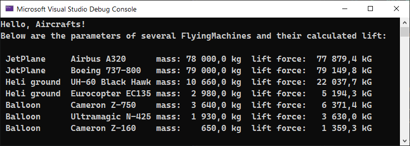
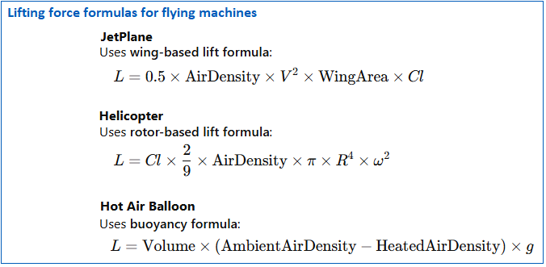

# Interfaces, abstract classes, polymorphism, inheritance in C#

## Overview: Demonstration of Important Techniques in program \"FlyingMachine\"

The program in C# (in the latest .NET9) effectively demonstrates: 

- interfaces;
- abstract classes;
- polymorphism;
- inheritance;
- tuple.

The program demonstrates the use of these elements by performing calculations for 
three different physical phenomena. They require three different computational 
methods but produce the same final result. Therefore, the principle of polymorphism 
and the other techniques mentioned can be used here.

This C# program models different types of flying machines—jet planes, helicopters, 
and hot air balloons—and calculates their lift forces based on distinct 
aerodynamic principles. 



## Key Object-Oriented Concepts Used

### 1. Interfaces (ILiftCalculator, IMessageFormat)

-   **ILiftCalculator**: Defines a **method signature** for calculating
    lift (CalculateLift()), ensuring all flying machines implement this
    method.

-   **IMessageFormat**: Introduces **C# 8 default interface methods**,
    defining the fMakeMessage() method **inside** the interface itself.

<b>Why is this useful?</b>

-   **Ensures common behavior** across multiple unrelated classes.

-   **Allows code reuse** (e.g., fMakeMessage() provides a consistent
    format for all flying machine outputs).

### 2. Abstract Class (FlyingMachine)

The FlyingMachine class:

-   Implements ILiftCalculator and IMessageFormat, **enforcing** common
    behaviors.

-   Contains **shared properties** (Name, Weight, AirDensity).

-   Declares **abstract methods** (CalculateLift() and
    FlyingMessage())---**forcing** derived classes to provide their own
    implementations.

<b>Why is this useful?</b>

-   **Encapsulates shared behavior** (no duplication of Name, Weight,
    AirDensity across classes).

-   **Promotes code reuse** while allowing **specialized
    implementations** in subclasses.

### 3. Inheritance (JetPlane, Helicopter, HotAirBalloon)

Each class **inherits from FlyingMachine** and implements the
CalculateLift() method **according to different physics principles**:




<b>Why is this useful?</b>

-   **Each machine has a unique lift calculation** but still shares the
    same interface and base class.

-   **Encapsulates physics formulas** in separate classes, improving
    **code organization**.

### 4. Polymorphism (List\<FlyingMachine\>)

The List\<FlyingMachine\> stores different objects (JetPlane,
Helicopter, HotAirBalloon) but **treats them uniformly** when calling
FlyingMessage().

```csharp


List<FlyingMachine> machines = new List<FlyingMachine>
{
  new JetPlane("Airbus A320", 78000, 0.38, 230, 122.6, 0.62),
  new Helicopter("UH-60 Black Hawk", 10660, 1.225, 8.18, 16.02, 0.22),
  new HotAirBalloon("Cameron Z-750", 3640, 21238, 1.225, 0.925)
};

foreach (var machine in machines)
{
  Console.WriteLine(machine.FlyingMessage());
}
```

<b>Why is this useful?</b>

-   **One loop handles all machine types** without checking their class
    type.

-   **Method overriding ensures each object executes the correct
    FlyingMessage() and CalculateLift()**.

### 5. Type Tuple (Method\GetAirDensity()\>)

The GetAirDensity() method of the CAir class returns data via the "tuple" type. 
This is a convenient and readable type that can return many different values. 
This ensures readability and simplicity of the methods.

## Additional Improvements

✔ **Formatted output:** The fMakeMessage() method ensures
well-structured output.\
✔ **Base class (CAir) for air properties:** Improves separation of
concerns.\
✔ **Debugging convenience (sMess variable):** Helps inspect output.

## Summary

- **Encapsulates** common behavior in an **abstract base class
(FlyingMachine)**.\
- Uses **interfaces (ILiftCalculator, IMessageFormat)** to enforce
behavior.\
- **Implements polymorphism**---objects are stored in a
List\<FlyingMachine\> and handled uniformly.\
- **Applies real-world physics formulas** for different flying
machines.

The use of the techniques described above greatly increases the readability,
structure, and modularity of the program. This provides a good demonstration 
of interfaces, inheritance, and polymorphism in C#.
